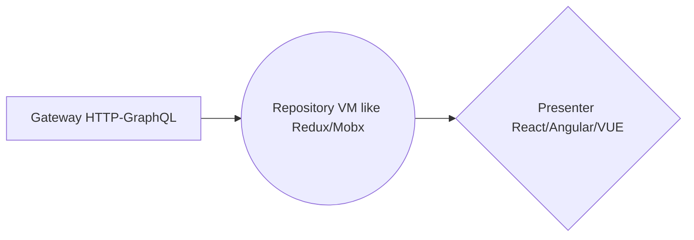

# Welcome to Checkout Test Review! 😀

Hi! 👋 Please look at the following steps to run this exercise.
- Clone/Download GIT repository.
- Navigate to checkout folder.
- Run `npm install` (Node version 18 and above)
- Run `npm start`. This should open browser at http://localhost:3000/
- Run `npm run test` to see unit tests
- Run `npm test -- --coverage` for coverage report

## Libraries used for development
- React with TS
- Formik for forms
- Yup for form validation
- D3.js for plotting chart
- Tailwind for CSS styling
- React Testing Library for testing

##	Folder structure
- `src/api` folder contains dummy json.
- `useFetchUser` hook loads json with delay of 1 second.
- `src/components` folder contains all the components used within app.
- `src/components/Application.tsx` is the main entry point.
- `lib` folder contains common logic used across app. for managing state. Please read ***State Management*** section for more details.

## Current Features 🤗
- Current application has 2 routes, ***Home*** and ***Comments***.
- Sate management using  `useReducer` and easy to replace current logic with libs like Redux from scalability point of view. Please read ***State Management*** section for more details.
- Scalable to add further screens.
- Improved performance by splitting ***Context*** in 2 parts to prevent unnecessary updation of child components. This avoids use of over memorization, which can further slow down the application. Please read ***Performance*** section for more details.
- Lazy loading of D3 charts.
- Responsive for various screen sizes using Tailwind.
- Accessibility test using `jest-axe` to quickly find any violation of a11y rules at high level.
- Use of skeleton components to improve CLS scores.
- Reusable form validation logic. 
- Unit test for Form component and Comments section.

## Missing ☹️ Features if given more time 
- Keyboard navigable application from a11y point of view.
- Add E2E tests using Cypress
- Add more tests related to form submission and reducers.
- Improve code coverage to at least 90%. Please read ***Testing*** section for more details.
- Use of library like Tanstack query/middlewares for data fetching. for more details please read ***State Management*** section for more details.
- Framework agnostic file structure. Please read ***Developing framework agnostic mindset*** section for more details.
- React profiler reports.

## State Management
When we talk about state management at application level, we have plenty of options available (Redux, MobX, UseReducer/Context (to remain in React world), Jotai, XState, Apollo Client etc.)

If we look at the architecture of state management, we are left with only 2 options.

1) Immutable State Trees.
2) Dependency Graph.

So, any library we choose, it falls in only one of the category and the golden rule is to decide the statement architecture first and then choose the library.

|                |Immutable State Trees                         |Dependency Graph                        |
|----------------|-------------------------------|-----------------------------|
|Redux|`YES`            |`NO`            |
|MOBx         |`NO`            |`YES`            |
|React UseReducer          |`YES`|`NO`|
|React Context          |`NO`|`YES`|
|Jotai          |`NO`|`YES`|
|Apollo Client          |`NO`|`YES`|
|XState          |`NO`|`YES`|
|TanStack Query          |`NO`|`YES`|

In current application, I have chosen Immutable State Trees option. I have used useReducer hook to manage state which can be replaced by Redux easily by just modifying the `user-reducer.ts` file.

If given more time, I would like go for state management with Dependency Graph because I don't see any use case to store stringify application state on server (unless there is requirement to store read/unread comments state when user logs off)

Although I have seen people moving away from Redux to TanStack Query due to large configuration issues with Redux. Seems like Immutable State Trees are no longer required in many use cases. 

## Testing
In general testing is done at three levels, unit, integration and e2e tests. In current application I have used RTL to write test cases. RTL is more opinionated towards integration testing. Please make sure NEVER target for 100% code coverage because it will lead to over mocking of data and it's a trap to produce false +ve results. Code coverage around 85% to 90% is good for any application.

## Developing framework agnostic mindset
JS frameworks are changing much faster than we change our clothes. Under such circumstances it becomes important to develop mindset that's independent of any framework/lib. 
Below diagram demonstrate this concept.

In this exercise, I will like to create gateway folder that will make call to comments API using fetch/tanstack query. Then in repository folder, I will create Reducer like functionality which serve as VM. This will contain all the business logic on the data fetched from HTTP . In presenter folder, I will create components that are independent of any business logic. This requires lot of time initially, but as the application scales up, it will easy to add more components i.e. React components can be replaced with VUE components, without much effort.

Word of caution, libraries like apollo client forces developer to write business logic within React components, but still by using custom hooks we can separate repositories from presenter. 

## Performance
In current application, I have handled performance related issues by code splitting and separating context in 2 parts, one for `state` and other for `dispatch` so that if child components who need only state are not impacted when `dispatch` is fired and vice-versa. Further I can wrap child components with `React.memo` for further optimization. The problem with memoisation is, if not used wisely can drop the performance becuse in JS memoisation happens through closures and closures are never garbage collected. So it's better to profile application before jumping in memoization.

### Please feel free to write any comment.

